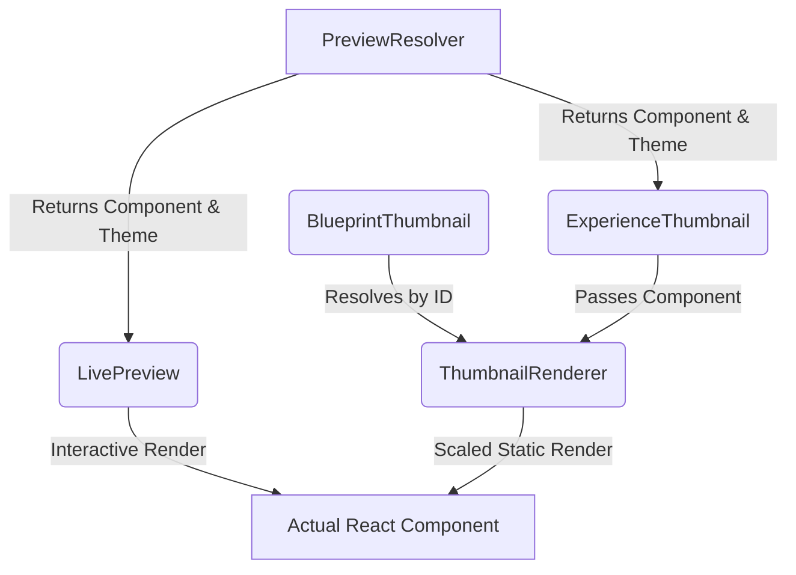

# Preview Architecture

## Overview
ZenixUI is a marketplace of website components. To allow users to browse and configure websites dynamically, we need a robust preview system. 

## Why PNG Previews Were Removed
The original architecture relied on static `.png` images mapped through a `preview-manifest.json`. This was fragile:
1. **Maintenance:** Every design change required regenerating screenshots.
2. **Reliability:** Missing files caused hundreds of 404 network errors.
3. **Accuracy:** Previews often became stale and didn't represent the actual installed component.

We migrated to a **Live Preview Architecture**. Previews are now actual React components rendered inside a constrained scaling wrapper.

## New Architecture

The new architecture relies on four focused components to handle different preview scenarios cleanly:

### Component Breakdown
1. **`PreviewResolver.ts`**: Pure function. Takes an `experienceId`, `brandId`, `variantId`, and `aestheticId` and returns the mapped `BlueprintComponent` and its theme.
2. **`LivePreview.tsx`**: Used in the Studio or details pages. It renders the resolved component at 100% scale in an interactive container.
3. **`ExperienceThumbnail.tsx`**: Used in Launchpad grids. It uses `PreviewResolver` to find the component, then passes it to `ThumbnailRenderer` to show a scaled-down, non-interactive preview card.
4. **`BlueprintThumbnail.tsx`**: Used in Templates and Docs pages. It takes a direct `blueprintId`, resolves the component from the registry, and passes it to `ThumbnailRenderer`.
5. **`ThumbnailRenderer.tsx`**: The internal scaling wrapper. It takes a raw React `Component`, wraps it in the correct theme provider, and uses CSS `transform: scale(...)` to shrink it perfectly into a thumbnail card.

## Request Flow

When a user views a grid of website templates (e.g. on the Launchpad):
1. The grid renders an `ExperienceThumbnail` for each experience.
2. `ExperienceThumbnail` calls `resolvePreview(experience, brand, variant, aesthetic)`.
3. The resolver traverses the Experience data model and looks up the exact blueprint ID.
4. The resolver returns the React Component constructor.
5. `ExperienceThumbnail` renders `ThumbnailRenderer`, passing the Component.
6. `ThumbnailRenderer` mounts the component inside a `pointer-events: none` scaled wrapper.

## Registry Flow & Component Resolution

All available blueprints are registered in `packages/blueprints/src/registry.ts`. The registry exports a massive array of `Blueprint` objects, each containing:
- `id`
- `component` (the React function)
- `theme`

When creating a new blueprint, you **must** add it to this registry. This is the single source of truth for component resolution across the entire monorepo.

## Server → Client Boundary

React Server Components (RSC) **cannot** pass functions (like React components) as props to Client Components. This restriction heavily dictates our architecture.

- **Rule:** Never pass `bp.component` from a Server Component to a Client Component.
- **Solution:** Server components (like Next.js `page.tsx` files) pass only **serializable IDs** (like `blueprintId`). The Client Components (`BlueprintThumbnail`, `ExperienceThumbnail`) perform the registry lookup entirely on the client side to retrieve the component function.

## Performance & Lazy Loading Strategy

Rendering 50 live React apps on a single page is expensive.
- **CSS Scaling vs Iframes:** We use `transform: scale()` instead of iframes. Iframes carry a massive memory overhead per instance. Scaling a DOM tree is much lighter.
- **Intersection Observers (Future/Current):** Previews should only mount complex logic when intersecting the viewport. By wrapping components in standard React Suspense or simple IntersectionObserver wrappers, we avoid executing 50 component lifecycles simultaneously on mount.

## How to Register a New Blueprint
1. Build your component in `packages/blueprints/src/components/...`
2. Export it from `packages/blueprints/src/index.ts`
3. Add an entry to `packages/blueprints/src/registry.ts` with its metadata and `component` reference.

## How to Create a New Experience
1. Open `apps/website/src/lib/launchpad/experiences/`
2. Create a new `.ts` file representing the industry.
3. Map its variants to the `blueprintId`s you registered in the previous step.

## Common Mistakes
- **Passing Component across Boundary:** `Warning: Functions cannot be passed directly to Client Components.` Always pass the ID and resolve client-side.
- **Missing Theme:** Forgetting to pass the `theme` prop to `ThumbnailRenderer` causes components to crash if they expect a specific `ZenixUIProvider` preset.
- **Nested Links:** `BlueprintThumbnail` does *not* include an `<a>` tag. Do not wrap it in another `<a>` tag if you place it inside a card that is already clickable, otherwise you will trigger hydration errors (`<a>` cannot be a descendant of `<a>`).
